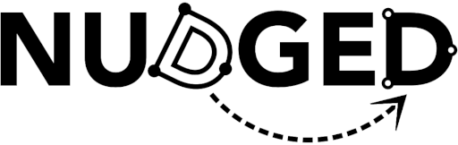
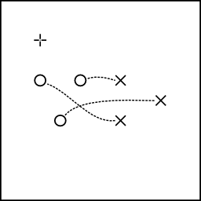
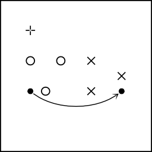
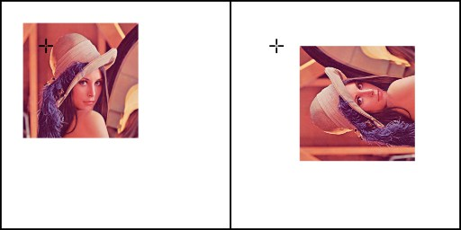
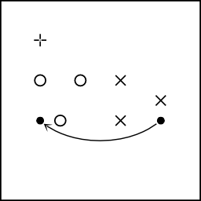
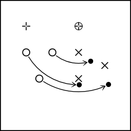
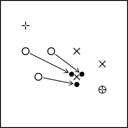
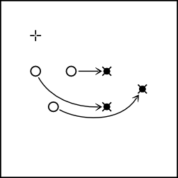
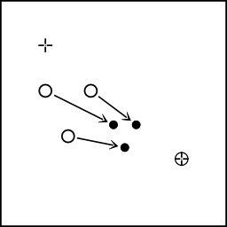
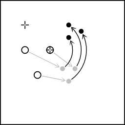

# nudged

*Nudged* is **a JavaScript module** to efficiently estimate translation, scale, and rotation between two sets of 2D points. It enables you to **capture transformations** that you can use for **motion dynamics, calibration, geometry snapping, and mapping between coordinate spaces**. It has already been applied to **user interface geometry [[1]](https://github.com/taataa/tapspace), multi-touch recognition [[1]](https://github.com/taataa/tapspace), and eye tracker calibration [[2]](https://github.com/infant-cognition-tampere/gazeanalysislib)**.

### Table of contents

- [Installation](#installation)
- [Introduction](#introduction)
- [Usage](#usage)
- [Example apps](#example-apps)
- [API docs](doc/API.md)
- [For developers](#for-developers)
- [Acknowledgments](#acknowledgments)
- [Versioning](#versioning)
- [Licence](#licence)

## Installation

Install `nudged` with [npm](https://www.npmjs.com/package/nudged) or other compatible package manager. The package comes in two flavors: functional and object oriented.

Install the functional nudged 2:

    $ npm install nudged

Install the object-oriented [nudged 1.x](https://github.com/axelpale/nudged/tree/1.x):

    $ npm install nudged@1

Nudged is also available [in Python](https://pypi.python.org/pypi/nudged).

## Introduction

In general, you can apply Nudged in any situation where you want to capture a 2D transformation based on a movement of any number of control points. You have a set of points, and they move from some source coordinates to some target coordinates. You want to capture the movement pattern between the source and the target as a 2D transformation. You may want to capture the pattern in order to apply it to something else, such as a photo or some other object. See the image below for the available transformations Nudged can estimate, illustrated with two control points and a photo.

 
_**Image**: Available transformation estimators. Each estimator has an abbreviated name, for example 'SR', according to the free parameters to estimate. The black-white dots and connecting arrows represent movement of two control points. Given the control points, Nudged estimates a transformation. The pairs of photos represent the effect of the resulting transformation. For easy visual comparison, the control points and the initial image positions are kept the same for each estimator._

**Mathematically speaking**, Nudged is a set of optimal [least squares estimators](https://en.wikipedia.org/wiki/Least_squares) for the group of nonreflective similarity transformation matrices, also called [Helmert transformations](https://en.wikipedia.org/wiki/Helmert_transformation). Such transformations are [affine transformations](https://en.wikipedia.org/wiki/Affine_transformation) with translation, rotation, and/or uniform scaling, and without reflection or shearing. The estimation has [time complexity](https://en.wikipedia.org/wiki/Time_complexity) of O(*n*), where *n* is the cardinality (size) of the point sets. In other words, Nudged solves a 2D to 2D point set registration problem (alias [Procrustes superimposition](https://en.wikipedia.org/wiki/Procrustes_analysis)) in [linear time](https://en.wikipedia.org/wiki/Time_complexity#Linear_time). The algorithms and their efficiency are thoroughly described in a **M.Sc. thesis** [Advanced algorithms for manipulating 2D objects on touch screens](http://URN.fi/URN:NBN:fi:tty-201605264186).

**The development has been supported** by [Infant Cognition Laboratory](https://www.tuni.fi/en/research/infant-cognition) at [Tampere University](https://www.tuni.fi/en/) where Nudged is used to correct eye tracking data. Yet, the main motivation for Nudged comes from [Tapspace](https://github.com/taataa/tapspace), a zoomable user interface library where smooth and fast scaling by touch is crucial.

## Usage

Let `domain` be a set of points, `[{ x, y }, ...]`. Let `range` be the same points after an unknown transformation T as illustrated in the figure below.

    const domain = [{ x: 0, y: 2 }, { x: 2, y: 2 }, { x: 1, y: 4 }]
    const range  = [{ x: 4, y: 4 }, { x: 4, y: 2 }, { x: 6, y: 3 }]

_**Figure**: The domain (circles o) and the range (crosses x). The + marks the point {x:0,y:0}._

We would like to find a simple 2D transformation `tran` that simulates T as closely as possible by combining translation, scaling, and rotation. We compute `tran` by calling [nudged.estimate](doc/API.md#nudgedestimate):

    const tran = nudged.estimate({
      estimator: 'TSR',
      domain: domain,
      range: range
    })

The result is a *transform* object:

    > tran
    { a: 0, b: -1, x: 4, y: 4 }

You can apply `tran` to a point with [point.transform](doc/API.md#nudgedpointtransform):

    > nudged.point.transform({ x: 0, y: 4 }, tran)
    { x: 6, y: 4 }

_**Figure**: A point {x:0, y:4} is transformed by the estimated transform._

You can apply `tran` to other geometric shapes as well, for example to correct the orientation based on some sensor data. In the case of HTML image elements, just convert `tran` to a [CSS transform](https://developer.mozilla.org/en-US/docs/Web/CSS/transform-function) string with [transform.toString](doc/API.md#nudgedtransformtostring):

    > img.style.transform = nudged.transform.toString(tran)

_**Figure**: An HTML image before and after the transform we estimated from the points._

The [nudged.transform](doc/API.md#nudgedtransform) module provides
lots of tools to process transform objects.
For example, to make a transformation that maps the range back to the domain
instead of another way around, invert the transform with [transform.inverse](doc/API.md#nudgedtransforminverse):

    > const inv = nudged.transform.inverse(tran)
    > nudged.point.transform({ x: 6, y: 4 }, inv)
    { x: 0, y: 4 }

_**Figure**: A point is transformed by the inverse of the estimated transform._

See [nudged.transform](doc/API.md#nudgedtransform) for more tools and details.

### Set a center point

To estimate scalings and rotations around a fixed point, give an additional `center` parameter. Only the estimators `S`, `R`, and `SR` respect the `center` parameter.

    const center = { x: 4 , y: 0 }
    const rotateAround = nudged.estimate({
      estimator: 'R',
      domain: domain,
      range: range,
      center: center
    })

You can think the center point as a nail that keeps an elastic sheet of rubber fixed onto a table. The nail retains its location regardless of how the rubber sheet is rotated or stretched around it.

_**Figure**: Rotation around a center point (⊕) maps the domain (o) as close to the range (x) as possible. Here the mapped image (●) cannot match the range exactly due to the restriction set by the center point. The + denotes the point {x:0, y:0}._

To test the resulting transform, we can apply it to the center point and observe that the point stays the same.

    > nudged.point.transform(center, rotateAround)
    { x: 4, y: 0 }

To estimate scalings in respect of a center point, as illustrated below, set `estimators: 'S'`. This scaling operation is also called a [homothety](https://en.wikipedia.org/wiki/Homothety).

    const s = nudged.estimate({
      estimator: 'S',
      domain: domain,
      range: range,
      center: center
    })

_**Figure**: The domain (o) is scaled towards the center point (⊕) so that the resulting image (●) lies as close to the range (x) as possible._

See [estimators.S](doc/API.md#nudgedestimatorss), [estimators.R](doc/API.md#nudgedestimatorss), and [estimators.SR](doc/API.md#nudgedestimatorss) for further details.

### Analyse the transform

To examine properties of the resulting transformation matrix:

    > nudged.transform.getRotation(tran)
    -1.5707... = -π / 2
    > nudged.transform.getScale(tran)
    1.0
    > nudged.transform.getTranslation(tran)
    { x: 2, y: 4 }
    > nudged.transform.toMatrix(tran)
    { a:  0, c: 1, e: 2,
      b: -1, d: 0, f: 4 }

To compare how well the transform fits the domain to the range, you can compute
the *mean squared error*, *MSE*. The smaller the error, the better the fit:

    > nudged.analysis.mse(tran, domain, range)
    0

The MSE of 0 means that the estimate maps domain on the range perfectly.
We can demonstrate this by transforming the domain points and
comparing the result to the range:

    > nudged.point.transformMany(domain, tran)
    [ { x: 4, y: 4 }, { x: 4, y: 2 }, { x: 6, y: 3 } ]
    > range
    [ { x: 4, y: 4 }, { x: 4, y: 2 }, { x: 6, y: 3 } ]

_**Figure**: The domain (o) mapped with `tran` (→). The fit is perfect, the image (●) matches the range (x) exactly._

See [nudged.analysis](doc/API.md#nudgedanalysis) for more.

### Build transforms

In addition to estimation, you can create transforms by other means. For example, let `t` be a 0.5x scaling towards `{ x: 6, y: 5 }`:

    > const t = nudged.transform.scaling({ x: 6, y: 5 }, 0.5)
    > t
    { a: 0.5, b: 0, x: 3, y: 2.5 }

Let us apply `t` to `domain`. The result is illustrated below.

    > nudged.point.transformMany(domain, t)
    [ { x: 3, y: 3.5 }, { x: 4, y: 3.5 }, { x: 3.5, y: 4.5 } ]

_**Figure**: Scaling the domain (o) by the factor of 0.5 about the center point (⊕). The resulting image (●) has all distances halved. The + denotes the point {x:0, y:0}._

Then let us modify the transform `t` further. Let `tr` be a transform that combines `t`
with a negative rotation of 45 degrees (π/4) around `{ x: 0, y: 0 }`:

    > const tr = nudged.transform.rotateBy(t, { x: 0, y: 0 }, -Math.PI / 4)
    > tr
    { a: 0.353..., b: -0.353..., x: 3.889..., y: -0.353... }

Let us apply the resulting transform to the domain points. The result is illustrated below.

    > nudged.point.transformMany(domain, tr)
    [
      { x: 4.596..., y: 0.353... },
      { x: 5.303..., y: -0.353... },
      { x: 5.656..., y: 0.707... }
    ]

_**Figure**: A scaling is combined with rotation so that the image of the scaling (grey ●) is further rotated by 90 degrees around a center point (⊕)._

Not all transformation need to be built. You can find some prebuilt transforms under [nudged.transform](doc/API.md#nudgedtransform):

    > const p = { x: 4, y: 2 }
    > const X2 = nudged.transform.X2
    > nudged.point.transform(p, X2)
    { x: 8, y: 4 }
    > const ROT180 = nudged.transform.ROT180
    > nudged.point.transform(p, ROT180)
    { x: -4, y: -2 }
    > const I = nudged.transform.IDENTITY
    > nudged.point.transform(p, I)
    { x: 4, y: 2 }

To discover more features and details, see [API](doc/API.md).

## Example apps

The following demo applications give an example how nudged can be used in the web.

### Multitouch transformation with N fingers

The [**touch gesture demo**](https://rawgit.com/axelpale/nudged/master/examples/nudged-gesture/index.html) takes the common pinch-zoom and rotate gestures a step further. Many multitouch apps allow you to scale and rotate with two fingers. However, usually the additional fingers are ignored. But what if one wants to use, say, both hands and all the fingers on a huge touchscreen?

For reference, the [**typical gesture demo**](https://rawgit.com/axelpale/nudged/master/examples/typical-gesture/index.html) implements similar demo with the popular [Hammer.js](http://hammerjs.github.io/) touch gesture library. As you can experience, only the first two pointers are regarded for scaling and rotation.

### Point set editor

The [**editor demo**](https://rawgit.com/axelpale/nudged/master/examples/nudged-editor/index.html) allows you to add domain and range points on a surface and explore how the points affect the transformation.

### Tokyo metro map viewer

In this [map viewer demo](https://rawgit.com/axelpale/nudged/master/examples/nudged-map/index.html), nudged is used to recognize multi-touch gestures to scale, rotate, and translate [a large image](https://commons.wikimedia.org/wiki/File:Tokyo_metro_map.png) on HTML5 canvas.

## API

[The functional 2.x API documentation](doc/API.md).

[The object-oriented 1.x API documentation](https://github.com/axelpale/nudged/tree/1.x#api)

## For developers

Guidelines:

- Use [ECMAScript 2015](https://en.wikipedia.org/wiki/ECMAScript) syntax with [CommonJS](https://en.wikipedia.org/wiki/CommonJS) module format.
- Follow [Standard](https://standardjs.com/) style:
  - 2 space indent
  - max 80 chars per line
  - spaces around operators
- Functional approach
  - namespaces and functions instead of classes and methods
  - immutable and stateless data handling; no in-place manipulation of arguments.
- Minimal run-time type checking
  - Nudged is designed to be a low-level module with high performance.
  - Instead of run-time checks, the geometries provide a dedicated .validate function.
- Write rich comments that answer the question "why".

Run lint & unit tests:

    $ npm run test

Build example apps:

    $ npm run build:examples

Start local server to try out the examples:

    $ npm start

Git workflow:

- Create a feature branch: `$ git branch feature-name`
- When feature finished, merge:
  - `$ git checkout master`
  - `$ git merge feature-name`
  - `$ git push`
  - Delete the feature branch.
- Bump version in package.json, `npm run gv`, and run tests.
- Build examples `npm run build:examples`
- Commit: `$ git commit -a -m "Release 7.7.7"`
- Create [tag](https://git-scm.com/book/en/v2/Git-Basics-Tagging):
  - `$ git tag -a 7.7.7 -m "v7.7.7 Superb Name"`
  - `$ git push --tags`
- Publish to npm:
  - `$ npm publish`

## Acknowledgments

We want to thank:

- [Tampere University of Technology](https://www.tuni.fi/en) and [Adj. Prof. Ossi Nykänen](https://www.researchgate.net/scientific-contributions/Ossi-Nykaenen-69896506) for guidance on the [M.Sc. thesis on Nudged](http://URN.fi/URN:NBN:fi:tty-201605264186).
- [Infant Cognition Laboratory at University of Tampere](https://www.tuni.fi/en/research/infant-cognition) and [Adj. Prof. Jukka Leppänen](https://scholar.google.fi/citations?user=dNRRUIsAAAAJ) for funding and support in research.
- [3D Media Group at Tampere University of Technology](https://www.tuni.fi/en/research/3d-media-group), [M.Sc. Olli Suominen](https://researchportal.tuni.fi/en/persons/olli-suominen), and [Prof. Atanas Gotchev](https://researchportal.tuni.fi/en/persons/atanas-gotchev) for providing touch-screen devices for testing.
- Tanja for math photos.
- Vilkku, Xiao, and Krista for illustrative finger photos.
- All contributors of pull requests and improvements over the years.

## Versioning

The versioning convention of the package follows [Semantic Versioning 2.0.0](http://semver.org/).

## Licence

The nudged source code is open source and free to use. It is released under a [MIT licence](LICENSE).
