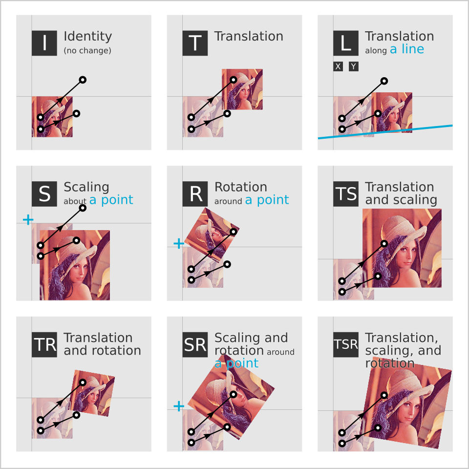

# nudged

*Nudged* is **a JavaScript module** to efficiently estimate translation, scale, and/or rotation between two sets of 2D points. It has already been applied to **user interfaces, multi-touch recognition, geography, and eye tracker calibration**.

### Table of contents

- [Introduction](#introduction)
- [Installation](#installation)
- [Usage](#usage)
- [Example apps](#example-apps)
- [API Docs](doc/API.md)
- [For developers](#for-developers)
- [Acknowledgments](#acknowledgments)
- [Versioning](#versioning)
- [Licence](#licence)

## Introduction

In general, you can apply Nudged in any situation where you want to capture a 2D transformation based on a movement of any number of control points. See the image below for the available transformations Nudged can estimate.

 
_**Image**: Available transformation estimators. Each estimator has an abbreviated name, for example 'SR', according to the free parameters to estimate. The black-white dots and connecting arrows represent movement of two control points. Given the control points, Nudged estimates a transformation. The pairs of photos represent the effect of the resulting transformation. For easy visual comparison, the control points and the initial image positions are kept the same for each estimator._

**Mathematically speaking**, Nudged is a set of optimal [least squares estimators](https://en.wikipedia.org/wiki/Least_squares) for the group of nonreflective similarity transformation matrices, also called [Helmert transformations](https://en.wikipedia.org/wiki/Helmert_transformation). Such transformations are [affine transformations](https://en.wikipedia.org/wiki/Affine_transformation) with translation, rotation, and/or uniform scaling, and without reflection or shearing. The estimation has [time complexity](https://en.wikipedia.org/wiki/Time_complexity) of O(*n*), where *n* is the cardinality (size) of the point sets. In other words, Nudged solves a 2D to 2D point set registration problem (alias [Procrustes superimposition](https://en.wikipedia.org/wiki/Procrustes_analysis)) in [linear time](https://en.wikipedia.org/wiki/Time_complexity#Linear_time). The algorithms and their efficiency are thoroughly described in a **M.Sc. thesis** [Advanced algorithms for manipulating 2D objects on touch screens](http://URN.fi/URN:NBN:fi:tty-201605264186).

**The development has been supported** by [Infant Cognition Laboratory](https://www.tuni.fi/en/research/infant-cognition) at [Tampere University](https://www.tuni.fi/en/) where Nudged is used to correct eye tracking data. Yet, the main motivation for Nudged comes from [Tapspace](https://github.com/taataa/tapspace), a zoomable user interface library where smooth and fast scaling by touch is crucial.

## Installation

With [npm](https://www.npmjs.com/package/nudged):

    $ npm install nudged

Available also [in Python](https://pypi.python.org/pypi/nudged).

## Usage

Let `domain` and `range` be sets of points `{ x, y }` before and after an unknown transformation as illustrated in the figure below.

    const domain = [{ x: 0, y: 0 }, { x: 2, y: 0 }, { x: 1, y: 2 }]
    const range  = [{ x: 1, y: 1 }, { x: 1, y: 3 }, { x: -1, y: 2 }]

_**Figure**: The domain (o circles) and the range (x crosses)._

Compute an optimal transformation based on the points:

    const tran = nudged.estimate({
      estimator: 'TSR',
      domain: domain,
      range: range
    })

The result is a *transform* object:

    > tran
    { a: 0, b: 1, x: 1, y: 1 }

You can apply the transformation to a point:

    > nudged.point.transform({ x: 2, y: 2 }, tran)
    { x: -1, y: 3 }

You can apply the transformation to an HTML image element:

    > img.style.transform = nudged.transform.toString(tran)

The [nudged.transform](doc/API.md#nudgedtransform) module provides
lots of tools to process transform objects.
For example, to make a transformation that maps the range back to the domain
instead of another way around, invert the transform with [transform.inverse](doc/API.md#nudgedtransforminverse):

    > const inv = nudged.transform.inverse(tran)
    > nudged.point.transform({ x: -1, y: 3 }, inv)
    { x: 2, y: 2 }

### Set a center point

To estimate scalings and rotations around a fixed point, give an additional `center` parameter. Only the estimators `S`, `R`, and `SR` respect the `center` parameter.

    const center = { x: 4 , y: 0 }
    const rotateAround = nudged.estimate({
      estimator: 'R',
      domain: domain,
      range: range,
      center: center
    })

You can think the center point as a nail that keeps a very elastic sheet of rubber fixed onto a table. The nail retains its location regardless of how the rubber sheet is transformed around it.

_**Figure**: Rotation around a center point (⊕) maps the domain (o) as close to the range (x) as possible. Here the mapped image (●) cannot match the range exactly due to the restriction set by the center point. The + denotes the point `{ x: 0, y: 0 }`._

To test the resulting transform, we can apply it to the center and observe that the point stays the same.

    > nudged.point.transform(center, rotateAround)
    { x: -1, y: 0 }

To estimate scalings in respect of a center point, as illustrated below, set `estimators: 'S'` and `center`. The operation is also called a [homothety](https://en.wikipedia.org/wiki/Homothety).

_**Figure**: Scaling the domain (o) by the factor of 0.5 about a center point (⊕). The resulting image (●) has all distances halved. The + denotes the point `{ x: 0, y: 0 }`._

### Analyze the transform

To examine properties of the resulting transformation matrix:

    > nudged.transform.getRotation(tran)
    1.5707... = π / 2
    > nudged.transform.getScale(tran)
    1.0
    > nudged.transform.getTranslation(tran)
    { x: 1, y: 1 }
    > nudged.transform.toMatrix(tran)
    { a: 0, c: -1, e: 1,
      b: 1, d:  0, f: 1 }

To compare how well the transform fits the domain to the range, you can compute
the *mean squared error*, *MSE*. The smaller the error, the better the fit:

    > nudged.analysis.mse(tran, domain, range)
    0

The MSE of 0 means that the estimate maps domain on the range perfectly.
We can demonstrate this by transforming the domain points and
comparing the result to the range:

    > nudged.point.transformMany(domain, tran)
    [{ x: 1, y: 1 }, { x: 1, y: 3 }, { x: -1, y: 2 }]
    > range
    [{ x: 1, y: 1 }, { x: 1, y: 3 }, { x: -1, y: 2 }]

See [nudged.analysis](doc/API.md#nudgedanalysis) for more.

### Build transforms

In addition to estimation, you can create transforms by other means. For example, let us create a 0.5x scaling about `{ x: 5, y: 4 }`:

    > const t = nudged.transform.scaling({ x: 5, y: 4 }, 0.5)
    > t
    { a: 0.5, b: 0, x: 2.5, y: 2 }

_**Figure**: Scaling the domain (o) by the factor of 0.5 about the center point (⊕). The resulting image (●) has all distances halved. The + denotes the point `{ x: 0, y: 0 }`._

Then let us create a transform `that` that develops `t`
by adding a negative rotation of 45 degrees (π/4) around `{ x: 0, y: 0 }`:

    > const that = nudged.transform.rotateBy(t, { x: 0, y: 0 }, -Math.PI / 4)
    > that
    { a: 0.353..., b: -0.353..., x: 3.181..., y: -0.353... }

Let us apply the resulting transform to the domain points:

    > nudged.point.transformMany(domain, that)
    [
      { x: 3.181..., y: -0.353... },
      { x: 3.889..., y: -1.060... },
      { x: 4.242..., y: 0.000... }
    ]

TODO mention prebuilt transforms

See [API](#api) for more.

## Example apps

The following demo applications give an example how nudged can be used in web.

### Multitouch transformation with N fingers

The [**touch gesture demo**](https://rawgit.com/axelpale/nudged/master/examples/nudged-gesture/index.html) takes the common pinch-zoom and rotate gestures a step further. Many multitouch apps allow you to scale and rotate with two fingers. However, usually the additional fingers are ignored. But what if one wants to use, say, both hands and all the fingers on a huge touchscreen?

For reference, the [**typical gesture demo**](https://rawgit.com/axelpale/nudged/master/examples/typical-gesture/index.html) implements similar demo with the popular [Hammer.js](http://hammerjs.github.io/) touch gesture library. As you can experience, only the first two pointers are regarded for scaling and rotation.

### Point set editor

The [**editor demo**](https://rawgit.com/axelpale/nudged/master/examples/nudged-editor/index.html) allows you to add domain and range points on a surface and explore how the points affect the transformation.

### Tokyo metro map viewer

In this [map viewer demo](https://rawgit.com/axelpale/nudged/master/examples/nudged-map/index.html), nudged is used to recognize multi-touch gestures to scale, rotate, and translate [a large image](https://commons.wikimedia.org/wiki/File:Tokyo_metro_map.png) on HTML5 canvas.

## API

See the [API documentation](doc/API.md).

## For developers

Guidelines:

- ES6
- [Standard style](https://standardjs.com/)
  - 2 space indent
  - max 80 chars per line
  - spaces around operators
- Functional approach
  - namespaces and functions instead of classes and methods
  - immutable and stateless data handling; no in-place manipulation.
- Minimal run-time type checking
  - Nudged is designed to be a low-level module with high performance.
  - Instead of run-time checks, the geometries provide a dedicated .validate function.
- Write rich comments that answer the question why.

Run lint & unit tests:

    $ npm run test

Build example apps:

    $ npm run build:examples

Start local server to try out the examples:

    $ npm start

Git workflow:

- Create a feature branch: `$ git branch feature-name`
- When feature finished, merge:
  - `$ git checkout master`
  - `$ git merge feature-name`
  - `$ git push`
  - Delete the feature branch.
- Bump version in package.json, `npm run gv`, and run tests.
- Build examples `npm run build:examples`
- Commit: `$ git commit -a -m "Release 7.7.7"`
- Create [tag](https://git-scm.com/book/en/v2/Git-Basics-Tagging):
  - `$ git tag -a 7.7.7 -m "v7.7.7 Superb Name"`
  - `$ git push --tags`
- Publish to npm:
  - `$ npm publish`

## Acknowledgments

We want to thank:

- [Tampere University of Technology](https://www.tuni.fi/en) and [Adj. Prof. Ossi Nykänen](https://www.researchgate.net/scientific-contributions/Ossi-Nykaenen-69896506) for guidance on the [M.Sc. thesis on Nudged](http://URN.fi/URN:NBN:fi:tty-201605264186).
- [Infant Cognition Laboratory at University of Tampere](https://www.tuni.fi/en/research/infant-cognition) and [Adj. Prof. Jukka Leppänen](https://scholar.google.fi/citations?user=dNRRUIsAAAAJ) for funding and support in research.
- [3D Media Group at Tampere University of Technology](https://www.tuni.fi/en/research/3d-media-group), [M.Sc. Olli Suominen](https://tutcris.tut.fi/portal/en/persons/olli-suominen(8d7b7ce4-1468-4621-9a6e-d307f644c9bb).html), and [Assoc. Prof. Atanas Gotchev](https://tutcris.tut.fi/portal/en/persons/atanas-gotchev(3b4a825b-941b-484e-b046-cd09bde1cd31).html) for providing touch-screen devices for testing.
- Tanja for math photos.
- Vilkku, Xiao, and Krista for finger photos.

## Versioning

[Semantic Versioning 2.0.0](http://semver.org/)

## Licence

[MIT Licence](../blob/master/LICENSE)
